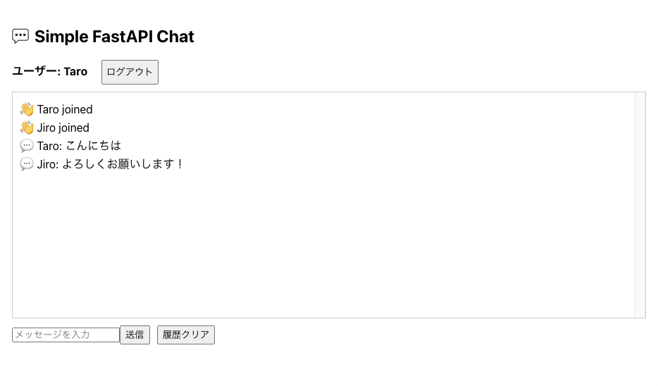
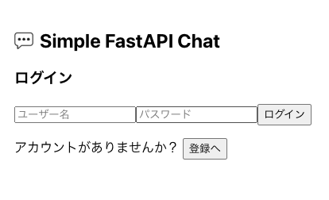
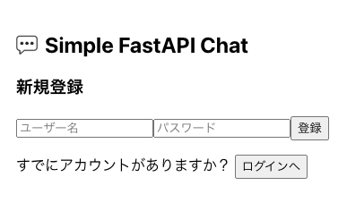

# Simple FastAPI Chat

FastAPI の WebSocket 機能を活用した、複数ユーザー対応のリアルタイムチャットアプリです。
デモ用に Azure Container Apps 上にデプロイ可能なシンプル構成で実装しています。


## Purpose（開発目的）

主な目的は **FastAPI を利用して Web アプリ開発を実践すること** です。  
その過程で以下についても理解を深めました：

- 認証  
- フロントエンド  
- ORM  


## Features（機能）

- **FastAPI の WebSocket 機能によるリアルタイムチャット**  
- **ユーザー登録 / ログイン（JWT 認証）**  
- **チャットメッセージの保存 / 取得**（SQLite + SQLAlchemy）  


## Tech Stack（技術スタック）

- **FastAPI** : バックエンドフレームワーク  
- **WebSocket** : リアルタイム通信  
- **React** : フロントエンド実装  
- **SQLite + SQLAlchemy** : データベースと ORM  
- **JWT** : ユーザー認証  
- **Argon2（passlib）** : パスワードハッシュ化  
- **Docker** : コンテナ化（Azure デプロイ用）  


## Screenshots / Demo（画面キャプチャ）

### チャット画面（複数ユーザーがリアルタイムでメッセージをやり取り）


- WebSocket を通じてリアルタイムにメッセージを送受信  
- メッセージ履歴が SQLite に保存され、再ログイン時にも参照可能  

### ログイン画面


- ユーザー名とパスワードでログイン  
- JWT により認証が行われ、トークンが発行される  

### 登録画面


- 新規ユーザー登録フォーム  
- パスワードは Argon2 によってハッシュ化されて保存  
（本番環境では新規ユーザー登録機能を 無効化設定 にしており、デモ用の事前登録アカウントで利用します）  


## Deployment（デプロイ）

本アプリケーションは **Azure Container Apps** 上にデプロイ予定です。  
GitHub Actions を用いた CI/CD パイプラインを構築し、`main` ブランチへの push をトリガーに自動デプロイされるようにします。 
（※現在はデモ用として 最小構成（単一コンテナ + SQLite） を採用しています。本番運用を想定する場合は、マネージドDBの導入やストレージ永続化など、改修が必要になります） 

- **デプロイ先**: Azure Container Apps  
- **レジストリ**: Azure Container Registry (ACR)  
- **スケーリング**: 最小インスタンス = 0、最大インスタンス = 1（コスト最適化）  
- **CI/CD**: GitHub Actions による Docker build → ACR push → Container Apps update  

### アクセス URL（予定）
👉 https://fastapi-chat-demo.<ランダム名>.azurecontainerapps.io  

※ 初回アクセス時はスリープからの起動で数秒待機が発生する場合があります  
※ 本番環境では新規ユーザー登録機能は **無効化設定** しています
代わりに、事前に作成したデモ用アカウントを含む SQLite データベースを同梱しています

### CI/CD ステータス


## Project Structure（プロジェクト構成）
```plaintext
.
├── backend/                      # バックエンド（FastAPI）
│   ├── main.py                   # エントリーポイント
│   ├── models.py                 # SQLAlchemy モデル定義
│
├── frontend/                     # フロントエンド（React）
│   ├── src/
│   │   ├── App.js                # メインコンポーネント
│   │   └── components/
│   │       ├── LoginForm.js      # ログインフォーム
│   │       └── RegisterForm.js   # 登録フォーム
│   └── package.json              # React 依存ライブラリ
│
├── tmp/                           # SQLite DB ファイル格納先
│   └── chat.db
│
├── .devcontainer/                # VS Code Dev Containers 用設定
│   └── devcontainer.json
│
├── requirements.txt              # Python 依存ライブラリ
├── Dockerfile                    # コンテナ定義
├── README.md
└── LICENSE
```

## Future Work（今後の改善点）

- **認証への理解の深化**  
  JWT 認証やセッション管理の仕組みをより実践的に学び、セキュアなアプリ設計へ発展させる  

- **フロントエンドへの理解強化**  
  React を中心としたフロントエンド開発について、UI/UX 改善や状態管理のベストプラクティスを学習する  

- **ORM への理解拡大**  
  SQLAlchemy を含む ORM の活用方法を学び、より複雑なデータモデリングやリレーション設計に対応できるようにする  

- **永続化ストレージの導入**
SQLite → マネージドDB への移行や Azure File Storage の利用で、本番環境に耐えられる設計へ拡張する

- **セキュリティ強化**
ユーザー登録の制御や CORS 設定の最適化など、本番運用を見据えた改善を行う


## License（ライセンス）

This project is licensed under the MIT License - see the [LICENSE](./LICENSE) file for details.